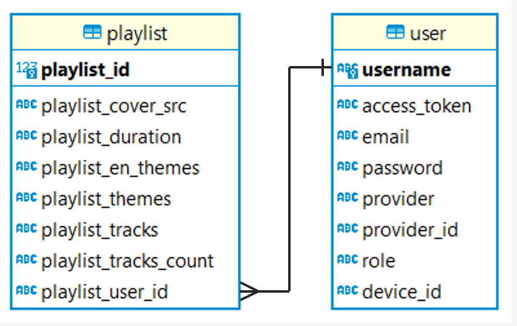

# AI기반 플레이리스트 생성 서비스 RhythmiQ

### 요약

> SBERT와 KNN 알고리즘을 이용해 입력 받은 문장을 테마로 변환해 해당 테마의 음악 플레이리스트를 생성해줍니다.
> 생성된 테마로 Stable Diffusion을 이용해 플레이리스트 커버 이미지를 생성해줍니다.

 

### 팀원 구성

>- 신원식 - 팀장, 백엔드, CI/CD [github](https://github.com/makethempubliq)  
>- 권민기 - 프론트엔드, 자연어 처리, 데이터 전처리 및 분석 [github](https://github.com/SophieKwonn)  
>- 김재원 - 데이터 수집 및 분석, 추천 알고리즘 개발 [github](https://github.com/jaewon9325)

 

### 기술 스택
>- Language : JAVA, Python
>- Front-End : HTML, JavaScript, CSS
>- Back-End : Spring Boot, FLASK
>- CI/CD : AWS ECR, ECS, S3, Route 53, Certificate Manager, Code Pipeline
>- Collaborate Tools : Github, Slack

 

### 개발 기간
>- **2024-05-02 ~ 2024-06-24**

 

## 기획

### 개발 배경
최근 음악 감상 트렌트가 다운로드에서 스트리밍으로 변화함에 따라 개별곡보다 이미 만들어진 플레이리스트를 소비하는 유저가 증가하였으며, 이에 대부분의 음악 스트리밍 서비스는 다양한 플레이리스트를 제공하고 있다. 하지만, 기존 서비스는 사용자 맞춤형 리스트를 제공하는 것이 아닌, 이미 생성되어있는 리스트를 제공하는 데 그친다는 한계점을 확인하였고, 이를 개선한 서비스를 개발하고자 하였다.

### 개발 목적
기존 스트리밍 서비스가 '선호 기반'의 추천을 하는 방식과 달리, 사용자가 원하는 테마나 목적에 기반한 음악 추천 서비스를 개발하여 보다 새로운 음악을 발견할 수 있는 기회를 확장하고, 희망 재생시간을 설정하여 더욱 편리한 음악 감상이 가능하도록 하였다.

### 기대 효과
B2C의 관점에서, 개별 곡이 아닌 플레이리스트를 소비하는 현재 음악 감상 트렌드를 반영하여, 사용자들은 더욱 편리하게 음악을 감상할 수 있다. 또한 재생 시간과 사용 목적에 맞춘 개인화된 리스트를 제공함으로써, 사용자가 직접 플레이리스트를 검색하고 선택할 필요가 없게 된다.
B2B의 관점에서는, 음악 큐레이션 업체들이 이 서비스를 활용하여 보다 손쉽게 플레이리스트를 생성할 수 있어 효율성이 증대된다.

 

## 사용 데이터
3회 카카오 아레나 대회 데이터 사용 - https://github.com/kakao/recoteam/discussions/9

 

## 데이터 전처리
Train 데이터의 'Tag' 컬럼을 아래 과정을 거쳐 정리하였으며, 3만 여개의 기존 태그를 641개로 축소하였다.

1. 불필요한 단어(추천, 노래, 음악 등) 및 고유명사(가수, 유저, 레이블 이름 등) 삭제
2. 형태소 분석기(Okt)를 사용하여 명사 및 형용사 이외 단어 삭제
3. 빈도수 22회 미만인 태그 삭제
4. 유사어 및 오타 정리

 

## 사용 모델
### KR-SBERT-V40K-klueNLI-augSTS - 입력 문장에서 테마 추출
SBERT는 문장 수준의 임베딩을 제공함에 따라 문장 간 유사도 계산에 용이하며, 특히 한 번에 임베딩을 생성하므로 후속연산이 빠르게 이루어져 대규모 작업에 유리하다.
우리 서비스에서는 입력 문장에서 추출한 단어와 가장 유사한 임베딩 값을 갖는 태그를 찾아내는 데 사용되었다.
### Stable Diffusion-XL 1.0-base - 플레이리스트 커버 이미지 생성
https://huggingface.co/stabilityai/stable-diffusion-xl-base-1.0 API 호출 방식으로 사용 
테마 목록을 입력 값으로 사용
### K-Nearist-Neighbor - 테마 기반 플레이리스트 생성
프로젝트에서 KNN모델은 플레이리스트와 곡 간의 관계를 나타내는 희소 행렬을 생성한다.
이 행렬은 플레이리스트와 곡의 포함 여부를 나타내며, KNN 모델의 입력으로 사용된다.
코사인 유사도를 사용하여 각 곡 간의 유사성을 측정하고, 가장 유사한 곡들을 찾아낸다.  
**추천 알고리즘 설명**
>1. 추천해야하는 트랙 수의 50%는 입력 테마가 속한 플레이리스트 중에서 소속 빈도 수가 높은 순으로 추출
>2. 나머지 50%는 입력 테마가 속한 플레이리스트의 모든 트랙에서 랜덤하게 선정
>3. 랜덤하게 선정한 트랙들에 KNN모델을 사용하여 각 트랙들과 유사한 곡 추출 (최종 결과에 무작위성 부여)

 

## ERD

**user 테이블** - 사용자 계정 데이터
- username - PK, Spotify에 등록된 User의 고유 ID
- access_token - Oauth2.0로그인시 발급되는 accesstoken값
- email - User의 Spotify E-mail
- password - Oauth2.0 로그인용 암호화값
- provider, provider_id - Spotify
- role - User의 권한
- device_id - 추천된 플레이리스트를 재생시킬 뮤직 플레이어의 ID

**playlist 테이블** - 사용자가 저장한 플레이리스트의 데이터
- playlist_id - PK, 저장된 플레이리스트의 고유 ID
- playlist_cover_src - S3에 저장된 Stable Diffusion이 생성한 이미지의 경로
- playlist_duration - 플레이리스트의 총 재생시간
- playlist_en_themes - 플레이리스트의 영문 테마
- playlist_themes - 플레이리스트의 테마
- playlist_tracks - 플레이리스트 수록곡들의 Spotify Track ID
- playlist_tracks_count - 플레이리스트의 수록곡 수
- playlist_user_id - 해당 플레이리스트를 저장한 User의 ID

 

## 시스템 구성도

**Spring Boot** 웹 서버, 테마 추출 및 플레이리스트 생성용 **Flask** 서버
, **Spotify API**, Hugging Face **Stable Diffusion API**로 구성
 

## 서비스 흐름도

  
사용자가 듣고 싶은 플레이리스트를 문장으로 입력시 문장을 SBERT를 이용해 테마 리스트로 변환, 해당 테마로 플레이리스트와 커버 이미지를 생성
 

## 구동 방법
### Base
1. 앱 생성 및 Client id 및 Client Secret 발급 - https://developer.spotify.com/dashboard
2. Redirect URI 등록 - http://localhost:8080/login/oauth2/authorization/spotify
3. AWS S3 Bucket 생성 및 데이터 파일 업로드 (경로 : 버킷명/data/) - https://drive.google.com/file/d/1DJn5bCax02uh1avpYloX3rsYaIAjUIlD/view?usp=drive_link, https://drive.google.com/file/d/1fVD-cOsX4X0kJN8t96yRLZhxPfIL59s0/view?usp=drive_link
4. Hugging Face API Accesstoken 발급
### Spring main server
1. SpotifyService.java, application.yml, diffuser.js 환경에 맞게 수정
2. MrsSpringWebApplication.java 실행
### Flask Model server
1. requirement.txt 라이브러리 설치 - pip install -r requirements.txt
2. s3config.yaml 파일 환경에 맞게 수정
3. main.py 실행

 

## 실행 화면

### 플레이리스트 생성 페이지

- 생성하고 싶은 플레이리스트에 대한 문장과 재생 시간을 설정한다.
### 플레이리스트 확인 페이지
- 생성된 플레이리스트의 테마와 트랙 목록을 확인할 수 있다.
- 재생 버튼을 클릭하면 뮤직 플레이어가 생성되고 음악이 재생된다.
- 저장 버튼을 클릭하면 플레이리스트의 데이터가 DB에 저장된다.
- 다운로드 버튼을 클릭하면 해당 플레이리스트가 스포티파이에 저장된다.

### 플레이리스트 목록 페이지

- 사용자가 저장한 플레이리스트의 목록을 확인하고 클릭시 해당 플레이리스트로 플레이리스트 확인 페이지로 이동한다.
- 삭제 버튼을 클릭하면 해당 플레이리스트를 DB에서 삭제한다.
 

## 배포

1. Github와 AWS CodePipeline 연동해서 Git push시 Docker Build
2. AWS ECR에 이미지 저장
3. AWS ECS Cluster에 Spring Boot, Flask 각각의 서비스 생성(Load Balencer 할당) 및 배포
4. AWS Route 53으로 각각의 Load Balencer DNS주소에 구입한 도메인 주소 할당
5. AWS Certificate Manager로 도메인 주소에 SSL 인증

>※ 배포시 Spring Boot, Flask의 buildspec.yml을 환경에 맞게 수정해주세요.

